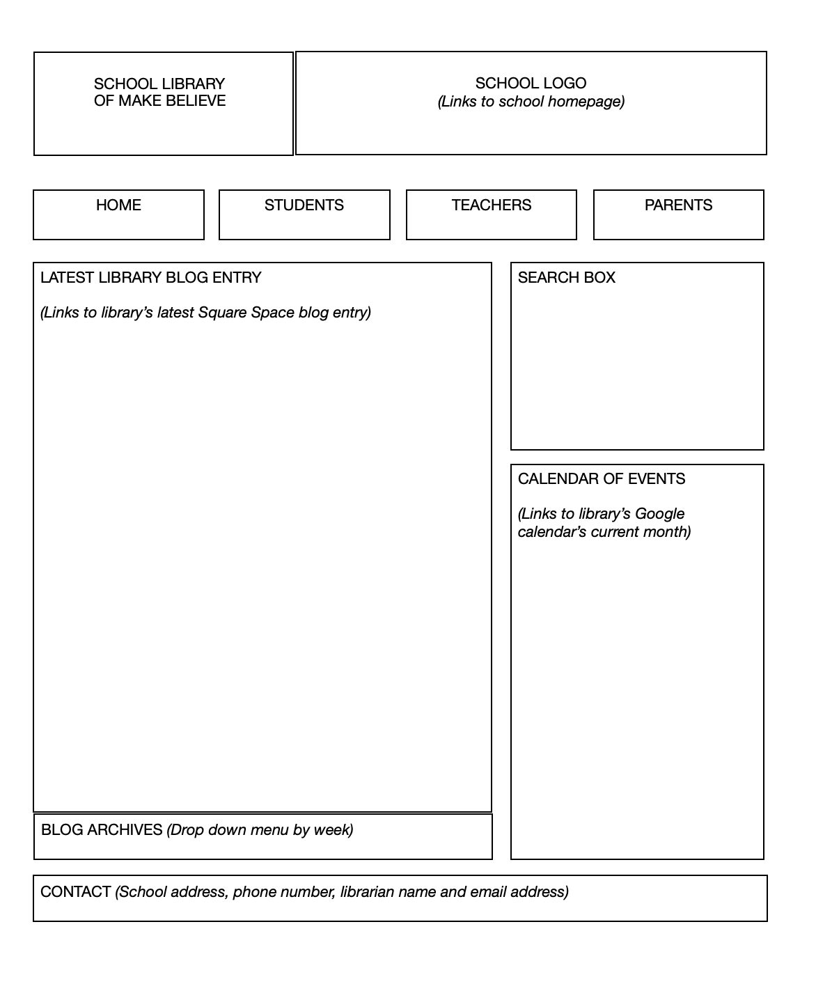
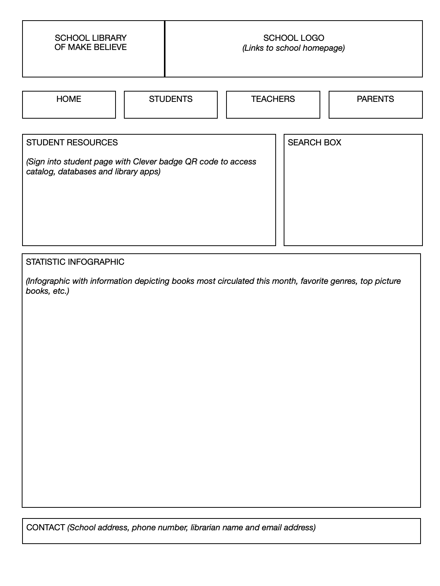

# Casey Gauss's INF6420 Project

### Purpose of Website: 
###### This website depicts a sample school library website, which is used by the school community - students, staff, parents and school administration.

### Wireframes Page 1 Description:

The first page is the library’s homepage, which is linked to the main school website. In the header, the user can click on the school logo to return to the main website. The navigation bar at the top of the library homepage allows the user to move between the main page, student page, teacher page and parent page. The section dedicated to the library blog will show users what student learning is happening in the library that week. If users want to view past newsletters, they can select an entry from the archives using a dropdown menu. The search box allows users to search the entire library webpage collection using keywords. The calendar of events is linked to the library’s Google calendar and depicts the current month. Events included might be book clubs, author visits, book fairs and other presentations. The footer on the main page provides the school and librarian’s contact information.

###### See Wireframe Page 1:

### Wireframes Page 2 Description:

The second page is a sample student page. In the header, the user can click on the school logo to return to the main school website. The navigation bar at the top of the student page allows the user to move between the library’s main page, student page, teacher page and parent page. The space dedicated to student resources asks the user to login with their Clever badge (QR code) in order to access the library’s online catalog, digital reading platforms, such as Epic, databases such as, GALE and EBSCO, encyclopedias, such as Britannica, MEL, World Book, and other free and subscription-based educational apps used by students. The search box allows users to search the entire library webpage collection using keywords. The statistics infographic is regularly updated with interesting statistics for students. It might provide them with links to the top books most circulated that month, or favorite books in a specific genre. The footer provides the school and librarian’s contact information.

###### See Wireframe Page 2:

### Wireframes Page 3 Description:

The third page is a sample teacher page. In the header, the user can click on the school logo to return to the main school website. The navigation bar at the top of the teacher page allows the user to move between the library’s main page, student page, teacher page and parent page. The space dedicated to teacher resources asks the user to login with their staff email and password in order to access the library’s catalog, databases, encyclopedias, and curated unit- and curriculum-materials. The search box allows users to search the entire library webpage collection using keywords. The section dedicated to tech tips and resources provides staff with articles and resources that describe useful technology for lesson planning. The archive takes the user to a page where all articles and resources are collected by topic. The footer provides the school and librarian’s contact information.

###### See Wireframe Page 3:

